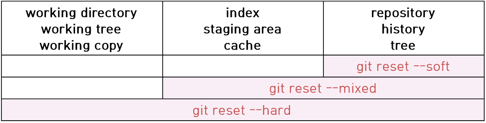

# 지옥에서 온 git

## 1. 버전 관리의 본질
### 1.1. git init
- 현재 디렉토리를 git repository로 만듦.
- git init을 실행하면 .git 이라는 디렉토리가 생기는데 .git에는 버전 정보들이 들어가 있다.

### 1.2. git add
- 버전 관리해야 할 파일을 추가하여 git에게 알려줌.
- add를 통해 변경사항을 선택적으로 commit을 할 수 있다.

### 1.3. git commit
- 버전 생성

### 1.4. git 설정
- git 설정

```
git config --global user.name jeonghyun
git config --global user.email yoojh9@gmail.com
```

### 1.5. stage area
- git add를 하면 stage로 올라가고, stage area는 commit 대기 장소이다.
- commit을 하게 되면 repository로 올라간다.

### 1.6. 변경 사항 확인(log & diff)
- git log \-p : 커밋과 커밋사이의 소스간의 차이를 알 수 있다
- git diff commit-id1 commit-id2 : 커밋 id1과 id2 사이의 소스 상의 차이를 보여줌

### 1.7. 과거로 돌아가기 (reset & revert)
- commit 취소
- git reset {commit_id} \--hard


<br><br>

## 2. branch
### 2.1 branch 정보 확인
- git log \--branches \--decorate : checkout 하고 있는 브랜치 외에 모든 브랜치의 상태를 보여줌
- git log \--branches \--decorate \--graph : 브랜치들의 상태를 그래프로 볼 수 있음
- git log \--branches \--decorate \--graph \--oneline : graph를 간략하게 볼 수 있다.
- git log -p master..exp : master 브랜치와 exp 브랜치간의 차이를 알 수 있음. (master에는 없고 exp에는 있는 것만 보여줌)
- git diff master exp에는

### 2.2 branch 병합(merge)
- git checkout master
- git merge exp
- fast forward(빨리감기) merge는 따로 commit을 추가하지 않지만, recursive merge방식은 commit을 새로 추가한다.

### 2.3 branch 삭제
- git branch -d exp

### 2.4 stash
- 브랜치에서 작업을 하다가 작업이 끝나지 않아서 커밋을 하기 어려운데, 다른 브랜치에서 작업을 해야할 경우 stash를 이용한다.
- 버전 관리가 되고 있는 파일만 가능하다.
- 예를 들어 exp 브랜치에서 f1.txt를 수정하고 커밋하지 않은 상태로 master 브랜치로 checkout 하면 f1.txt의 수정사항을 볼 수 있다.
- 하지만 stash를 이용하면 작업했던 내역을 숨겨 저장할 수 있으므로 master로 checkout 하더라도 영향이 없다.
- git stash : 임시 작업공간에 저장
- git stash apply : 임시 작업공간에 저장했던 것을 불러옴
- git stash list : stash list를 조회
- git stash drop : list 가장 상단의 stash를 지움
- git stash pop : git stash apply + git stash drop


<br><br>

## 3. git의 원리
### 3.1 reset checkout
- git reflog : commit과 head 정보들을 알 수 있음.

### 3.2 git reset



### 3.3 3 way merge


---
#### 참고
[생활코딩 - 3 way merge](https://opentutorials.org/module/2676/15307) <br>
